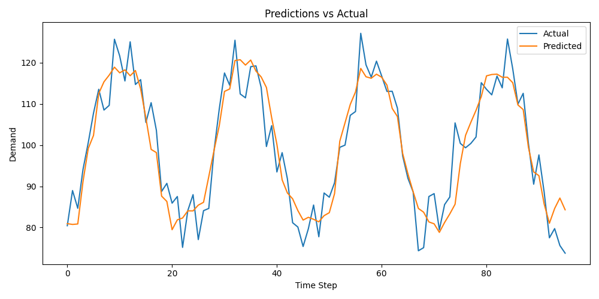
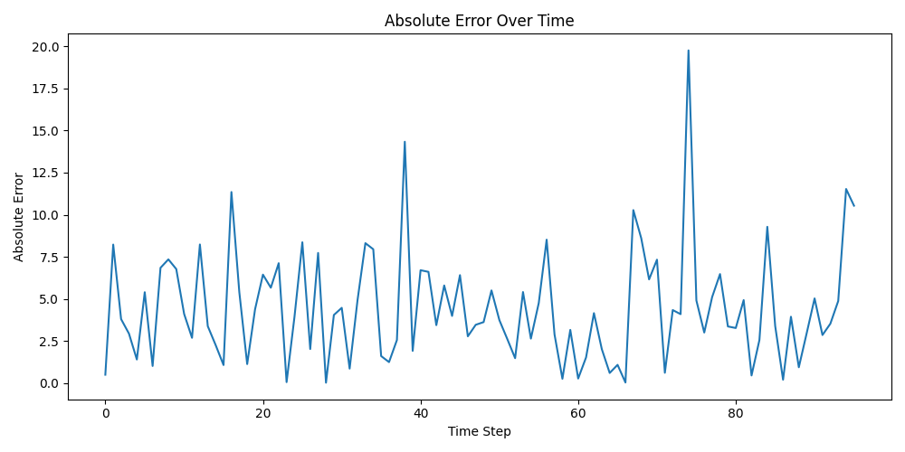
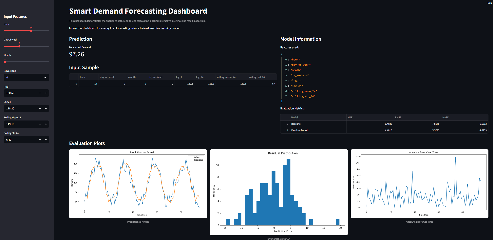

# Smart Demand Forecasting


An end-to-end machine learning system for energy load forecasting, covering data preprocessing, 
feature engineering, model training, evaluation, API deployment, and interactive dashboard.

## Overview

This project demonstrates a complete ML pipeline:
- Data ingestion and preprocessing
- Feature engineering (time-based, lag, rolling features)
- Model training (Random Forest)
- Evaluation and error analysis
- API deployment with FastAPI
- Interactive dashboard with Streamlit

---

## Project Structure

```
smart-demand-forecasting/
├── app/
├── assets/
├── dashboard/
├── data/
│   └── processed/
│   └── raw/
│   └── sample/
├── models/
├── notebooks/
├── reports/
│   └── figures/
├── tests/
├── .gitignore
├── README.md
└── requirements.txt
```

---

## Pipeline

1. Generate or load data
2. Create features
3. Train model
4. Evaluate performance
5. Serve predictions via API
6. Visualize results in dashboard

---

## Results

### Prediction vs Actual


### Residual Distribution


### Absolute Error Over Time


## API

Run locally:

```
uvicorn app.api.main:app --reload

```

Endpoints:
- `/health`
- `/model-info`
- `/predict`


---

## Dashboard


The project includes an interactive Streamlit dashboard for exploring model predictions and evaluation results.

### Features
- Manual input of engineered forecasting features
- Real-time model inference
- Display of evaluation metrics
- Visualization of forecasting results and residual analysis

### Run dashboard
```
streamlit run dashboard/app.py
```

---

## Feature Engineering

The model uses a combination of:

- Time-based features (hours, day of week, month)
- Lag features to capture temporal dependencies
- Rolling statistics to capture short-term trends and variability

This allows the model to learn both periodic patterns and recent dynamics in the data.

---

## Motivation

This project was designed to demonstrate applied machine learning and data science workflow development in a complete, reproducible system.
The focus is not only on model performance, but also on engineering structure, interpretability, and deployment. 

---

## Tech Stack

- Python
- pandas / NumPy
- scikit-learn
- FastAPI
- Streamlit
- matplotlib / plotly

---

## Future Improvements
- Deep learning models (LSTM)
- Hyperparameter tuning
- Real-world datasets
- Deployment (Docker / Cloud)


