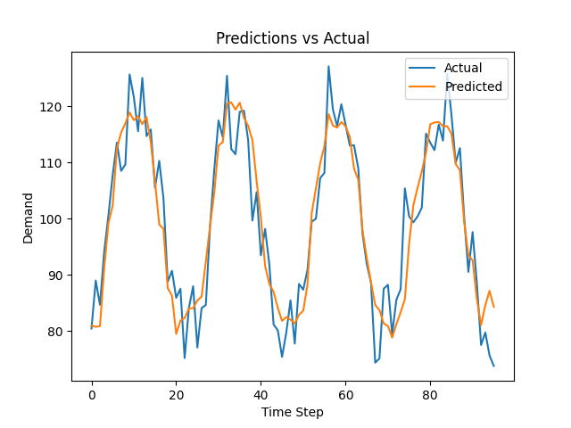
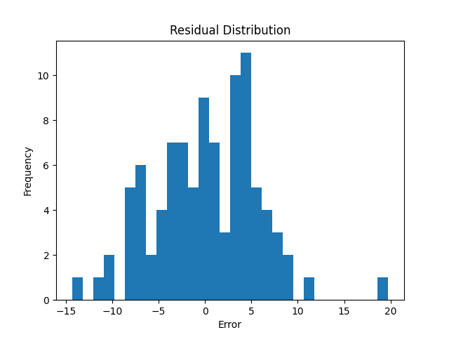

# Smart Demand Forecasting

An end-to-end machine learning system for energy load forecasting, covering data preprocessing, 
feature engineering, model training, evaluation, API deployment, and interactive visualization.

---

## Results

### Prediction vs Actual


### Residual Distribution


---

## Feature Engineering

The model uses a combination of:

- Time-based features (hours, day of week, month)
- Lag features to capture temporal dependencies
- Rolling statistics to capture short-term trends and variability

This allows the model to learn both periodic patterns and recent dynamics in the data.

---

## Motivation

This project was designed to demonstrate applied machine learning and data science workflow development in a complete, reproducible system.
The focus is not only on model performance, but also on engineering structure, interpretability, and deployment. 

---

## Tech Stack

- Python
- pandas / numpy
- scikit-learn
- XGBoost
- FastAPI
- Streamlit
- matplotlib / plotly

---

```
smart-demand-forecasting/
├── app/
├── dashboard/
├── data/
│   └── processed/
│   └── raw/
│   └── sample/
├── models/
├── notebooks/
├── reports/
│   └── figures/
├── tests/
├── .gitignore
├── README.md
└── requirements.txt
```
